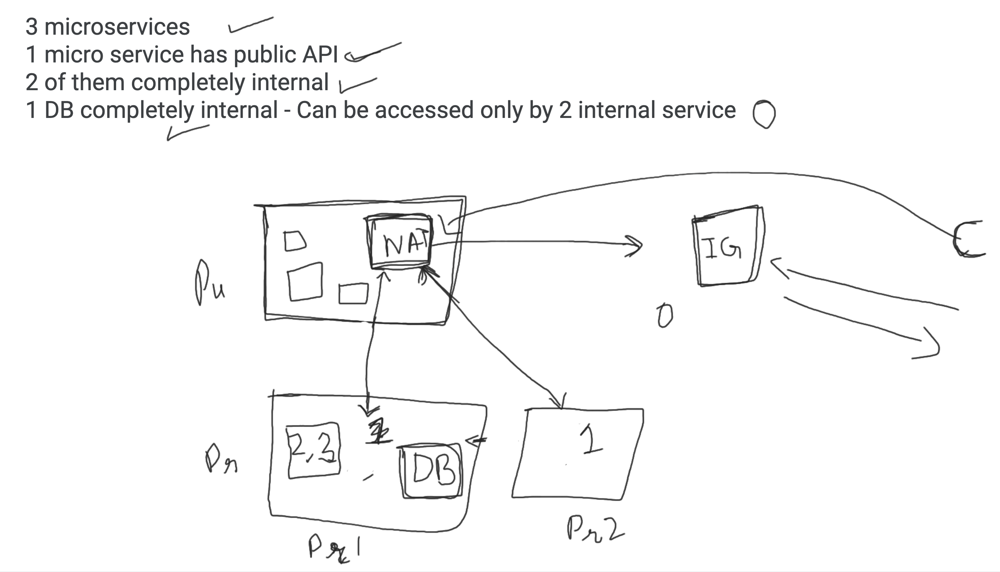
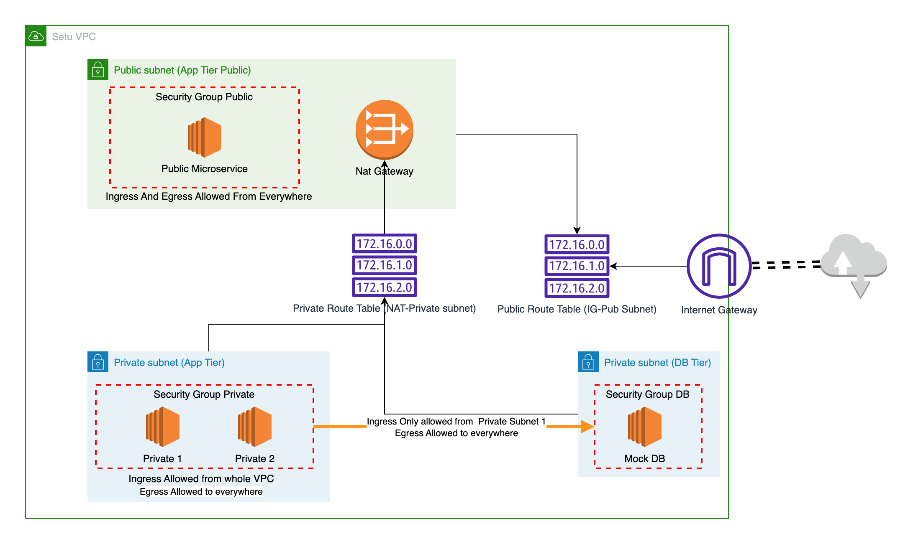

<!-- BEGIN_TF_DOCS -->

## Requirements

To create a VPC such that
- 3 microservices
- 1 micro service has public API
- 2 of them completely internal
- 1 DB completely internal - Can be accessed only by 2 internal service

The problem was further broken down into this figure


## Aproaches 
### __1. Security Group \[IMPLEMENTED\]__
This is the approach which is submitted with the assignment.
Basically creating 3 seperate security groups 
- Public App
    - Ingress Allowed from anywhere
    - Egress allowed to anywhere
- Private App
    - Ingress Allowed from inside VPC
    - Egress allowed to anywhere
- DB
    - Ingress Allowed from Private App Security Group
    - Egress allowed to anywhere

Thus creating the specification as asked in the requirements.

__Note - For this approach we do not need 2 Private subnet, But I have kept them as I also tried the NACL approach which you can find in `./bkp/nacl_approach.tf.bkp`__

### __2. NACL Aproach__
In this apporach we planned to make a network ACL for each of the 3 subnet
- Public App NACL
    - Ingress Allowed from anywhere
    - Egress allowed to anywhere
- Private App NACL
    - Ingress Allowed from inside VPC
    - Egress allowed to anywhere
- DB NACL
    - Ingress Allowed from Private App Subnet
    - Egress allowed to anywhere

__Why not implemented? -__

- This caused a problem in DB NACL as it would not allow ingress traffic to download packages and accesing the internet from the Private ACLs as NACL are not stateful so you have to allow both inbound and outbound traffic seperately for each subnet.

- This approach was working in terms of the requirements given by the question. But we couldn't connect private boxes to internet gateway without reducing the strictness of our ACLs.

This approach is in bkp `./bkp/nacl_approach.tf.bkp` file.

### __3. Kube Network Policy approach__

Kubernetes Provide Network Policies for every kube resource we can make namely namespace, pods, deployments, svc etc.
These network policies can control ingress and egress traffic to these resources at a fine grained level. [Know more](https://kubernetes.io/docs/concepts/services-networking/network-policies/)

__Why not implemented? -__

- This was VPC agnostic approach and required Kube cluster to be setup. 
- This also required DB (Statefu application) to be run in kube. We do have statefulsets to do so but managing DB in Kube is added effort and not advised.


# Solution-

## Architectural Diagram


## Explanation
> __Question at a glance__ 
>
> To create a VPC such that
> - 3 microservices
> - 1 micro service has public API
> - 2 of them completely internal
> - 1 DB completely internal - Can be accessed only by 2 internal service

__Breaking down the question-__

Assuming we want to have a VPC infrastructure to solve this question.

> - 3 microservices

This can be mock EC2 Instances running http apache servers

> - 1 micro service has public API

We need 1 of these ec2 boxes in Public subnet accesible through internet and having a public IP

> - 2 of them completely internal

Two of the ec2 should be in Private subnet accesible from the whole VPC but not accesible from outside VPC. 

> - 1 DB completely internal - Can be accessed only by 2 internal service

So the Database will be behind a rule so that it can be only accessed by the private apps and not the public one and also not by anywhere else

So we need - 
- 1 Private Subnet atleast
- Internet gateway to access internet from all above microservices.
- NAT gateway to access internet from Private Services as they do not have access to IG directly.
- Security groups for the segregation of traffic asked in the question.
    - Public
    - Private
    - DB
- 2 Route tables to connect 
    - the Private subnets to NAT
    - public subnets to IG.
- SSH keys to access the boxes for debugging.

__Security Group Explanation-__
This is the approach which is submitted with the assignment.
Basically creating 3 seperate security groups 
- Public App
    - Ingress Allowed from anywhere
    - Egress allowed to anywhere
- Private App
    - Ingress Allowed from inside VPC
    - Egress allowed to anywhere
- DB
    - Ingress Allowed from Private App Security Group
    - Egress allowed to anywhere

__Verification__- 
- You can see the public microservices will show you the combined responses of all the microservices and the connections between them as shown in `output_html`

## How to Run
Make sure you have terraform installed in your laptop
### Directory - 
- `main.tf` - This includes the code to create the VPC and the solution
- `test_infra.tf` - This includes the code to create the Dummy Microservices

__Step 1.__ 
Create the keys for EC2 Instance and initialize tf repo
```
make init
```

__Step 2.__ 
Add your aws creds in `variables.tf`

__Step 3.__ 
Create the infrastructure
```
make apply
```

__Step 4.__ 
Test the infra. The output of tf is the IP of the public response which serves the responses from each microservices combined on port `80`. And serves as a proof for you to check the connection regulations.

__Step 5.__
Destroy the infra
```
make destroy
```
Fin.

---
# TF Docs- 
## Providers

| Name | Version |
|------|---------|
| <a name="provider_aws"></a> [aws](#provider\_aws) | 2.70.4 |

## Resources

| Name | Type |
|------|------|
| [aws_default_security_group.default](https://registry.terraform.io/providers/hashicorp/aws/latest/docs/resources/default_security_group) | resource |
| [aws_eip.nat_gateway](https://registry.terraform.io/providers/hashicorp/aws/latest/docs/resources/eip) | resource |
| [aws_instance.mock_db_service](https://registry.terraform.io/providers/hashicorp/aws/latest/docs/resources/instance) | resource |
| [aws_instance.private_microservice_1](https://registry.terraform.io/providers/hashicorp/aws/latest/docs/resources/instance) | resource |
| [aws_instance.private_microservice_2](https://registry.terraform.io/providers/hashicorp/aws/latest/docs/resources/instance) | resource |
| [aws_instance.public_microservice](https://registry.terraform.io/providers/hashicorp/aws/latest/docs/resources/instance) | resource |
| [aws_internet_gateway.internet-gateway](https://registry.terraform.io/providers/hashicorp/aws/latest/docs/resources/internet_gateway) | resource |
| [aws_key_pair.ssh_keys](https://registry.terraform.io/providers/hashicorp/aws/latest/docs/resources/key_pair) | resource |
| [aws_nat_gateway.nat_gateway](https://registry.terraform.io/providers/hashicorp/aws/latest/docs/resources/nat_gateway) | resource |
| [aws_route_table.nat_route_table](https://registry.terraform.io/providers/hashicorp/aws/latest/docs/resources/route_table) | resource |
| [aws_route_table.public-route-table](https://registry.terraform.io/providers/hashicorp/aws/latest/docs/resources/route_table) | resource |
| [aws_route_table_association.private_subnet_1_nat_rt_association](https://registry.terraform.io/providers/hashicorp/aws/latest/docs/resources/route_table_association) | resource |
| [aws_route_table_association.private_subnet_2_nat_rt_association](https://registry.terraform.io/providers/hashicorp/aws/latest/docs/resources/route_table_association) | resource |
| [aws_route_table_association.public-subnet-1-route-table-association](https://registry.terraform.io/providers/hashicorp/aws/latest/docs/resources/route_table_association) | resource |
| [aws_security_group.db_sg](https://registry.terraform.io/providers/hashicorp/aws/latest/docs/resources/security_group) | resource |
| [aws_security_group.private_app_sg](https://registry.terraform.io/providers/hashicorp/aws/latest/docs/resources/security_group) | resource |
| [aws_security_group.public_app_sg](https://registry.terraform.io/providers/hashicorp/aws/latest/docs/resources/security_group) | resource |
| [aws_subnet.private-subnet-1](https://registry.terraform.io/providers/hashicorp/aws/latest/docs/resources/subnet) | resource |
| [aws_subnet.private-subnet-2](https://registry.terraform.io/providers/hashicorp/aws/latest/docs/resources/subnet) | resource |
| [aws_subnet.public-subnet-1](https://registry.terraform.io/providers/hashicorp/aws/latest/docs/resources/subnet) | resource |
| [aws_vpc.setu_vpc](https://registry.terraform.io/providers/hashicorp/aws/latest/docs/resources/vpc) | resource |
| [aws_ami.ubuntu](https://registry.terraform.io/providers/hashicorp/aws/latest/docs/data-sources/ami) | data source |

## Inputs

| Name | Description | Type | Default | Required |
|------|-------------|------|---------|:--------:|
| <a name="input_access_key"></a> [access\_key](#input\_access\_key) | variables.tf | `any` | n/a | yes |
| <a name="input_private-subnet-1-cidr"></a> [private-subnet-1-cidr](#input\_private-subnet-1-cidr) | Private Subnet 1 CIDR Block | `string` | `"10.0.1.0/24"` | no |
| <a name="input_private-subnet-2-cidr"></a> [private-subnet-2-cidr](#input\_private-subnet-2-cidr) | Private Subnet 2 CIDR Block | `string` | `"10.0.2.0/24"` | no |
| <a name="input_public-subnet-cidr"></a> [public-subnet-cidr](#input\_public-subnet-cidr) | Public Subnet 1 CIDR Block | `string` | `"10.0.0.0/24"` | no |
| <a name="input_region"></a> [region](#input\_region) | AWS Region | `string` | `"ap-south-1"` | no |
| <a name="input_secret_key"></a> [secret\_key](#input\_secret\_key) | n/a | `any` | n/a | yes |
| <a name="input_vpc-cidr"></a> [vpc-cidr](#input\_vpc-cidr) | VPC CIDR Block | `string` | `"10.0.0.0/16"` | no |

## Outputs

| Name | Description |
|------|-------------|
| <a name="output_public_box_ip"></a> [public\_box\_ip](#output\_public\_box\_ip) | n/a |
<!-- END_TF_DOCS -->